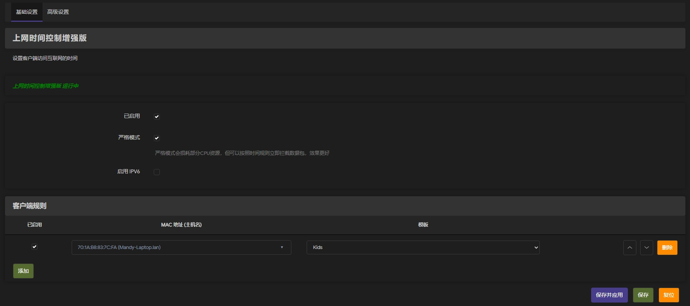
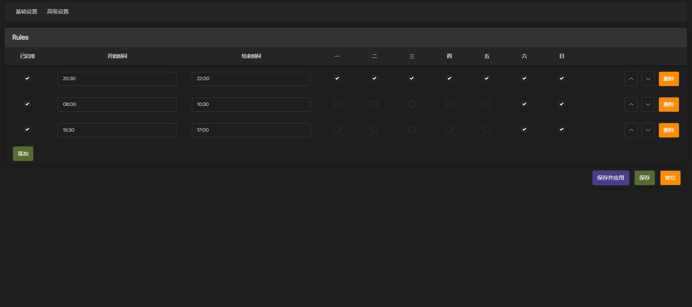

Openwrt 上网时间控制控件Plus

特点：精准控制网络设备上网时间

**规则模板**

可以设定多套模板，每天模板对应多个上网时间规则

**绑定网卡物理地址**

采用绑定网卡物理和模板规则

**无需设定黑名单**

已经启用上网控制的网卡物理地址，自动进入防火墙过滤，非使用时间自动过滤。

**防火墙框架支持**

同时支持 fw3（iptables）与 fw4（nftables），启动时自动检测（检测 `fw4`/`nft` 命令是否存在）：

- 默认（fw3 / iptables）：使用 iptables/ip6tables；`ipv6enable` 开关决定是否同时管控 IPv6。
- fw4（nftables）：使用 nft 单表（`inet miaplus`）。IPv4/IPv6 由同一张 `inet` 表处理，但遵循 `ipv6enable` 开关——关闭时规则加 `meta nfproto ipv4` 限定，行为与 fw3 一致。

**fw4 时区注意事项**

fw3 用 `-m time --kerneltz`，由内核按设备时区实时判断；fw4 的 nft `meta hour/day` 在**加载规则时**由用户态按当前时区折算成 UTC 偏移写死进规则。因此修改系统时区或发生 DST 切换后，fw4 下的规则窗口会整体偏移，需重新执行 `/etc/init.d/miaplus restart` 恢复。

**IPv6 绕过风险**

管控依赖对 DNS 查询（53 端口）的拦截。若 `ipv6enable=0`（不管控 IPv6），客户端仍可通过**原生 IPv6 网络的 DoH / DoT / 直连 IP** 等手段解析并访问，从而绕过上网时限控制；此规避在 fw3 与 fw4 下同样存在。如需严格管控，请启用 IPv6 管控并配合防火墙放行策略一起收紧。

**依赖说明**

- fw3 依赖 iptables 系列内核模块（见下）。
- fw4 不额外声明 nft 依赖：`firewall4` 依赖 `nftables-json` 已顺带提供 `/usr/sbin/nft`，且固件已启用 nf_tables。为避免强制所有用户（含 fw3）安装 nft 相关包、以及历史上将 iptables 系列写进 `LUCI_DEPENDS` 后招致兼容问题的前例（见提交 aaa18be / 5e97062 的回滚），本包 `LUCI_DEPENDS` 刻意保持最小依赖 `+snmpd`。

**本插件需要安装以下库**

请检测是否已安装 snmpd iptables kmod-ipt-nat kmod-nf-nat

如需要支持ipv6请安装 ip6tables

同时需要安装网络基础组件

**待真机验证（fw4 / OpenWrt ≥ 23.05 + firewall4）**

以下项无法在开发环境静态验证，需在装有 firewall4 的固件上实测后再发布：

- **T1**：`/etc/init.d/miaplus status` 的返回码。LuCI 状态灯依据返回码（非 stdout）判断，需确认非 procd 脚本下 `EXTRA_COMMANDS=status` 能正确把 `status` 路由到自定义 `status()` 并返回 0/非 0。
- **T2**：`/etc/init.d/firewall reload` 后 `inet miaplus` 表是否只保留一份、规则条数不翻倍（确认 include 触发 restart 且无重复添加）。
- 另：`nft list table inet miaplus` 核对生成的时段/星期/`meta nfproto ipv4` 规则是否符合预期；DNS(53) 重定向与 fw4 主表 NAT 是否互抢（见 init.d 表头注释）。

**感谢**

coolsnowwolf

本插件基于大神版本修改
https://github.com/coolsnowwolf/luci/tree/master/applications/luci-app-accesscontrol

软件安全无毒，请放心下载使用

感谢您的支持，遇到问题可以反馈
